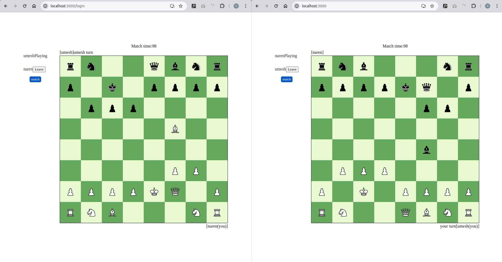

# Live Chess

Live Chess is a real-time multiplayer chess application built using Node.js, socket.io, and React.js. This project allows users to play chess with friends, send play requests, and get randomly matched by the server.

## Features

- Play chess in real-time with friends
- Send play requests to friends
- Random matchmaking by the server
- Interactive and responsive UI

## Tech Stack

- **Backend:** Node.js, socket.io
- **Frontend:** React.js

## Screenshots



## Installation

1. **Clone the repository:**

    ```bash
    git clone https://github.com/narenMagarZ/live-chess.git
    cd live-chess
    ```

2. **Install backend dependencies:**

    ```bash
    cd backend
    npm install
    ```

3. **Install frontend dependencies:**

    ```bash
    cd frontend
    npm install
    ```

## Running the Application

1. **Start the backend server:**

    ```bash
    npm run dev
    ```

    The backend server will start on `http://localhost:5000`.

2. **Start the frontend application:**

    ```bash
    npm run start
    ```

    The frontend application will start on `http://localhost:3000`.
# Live-Chess
